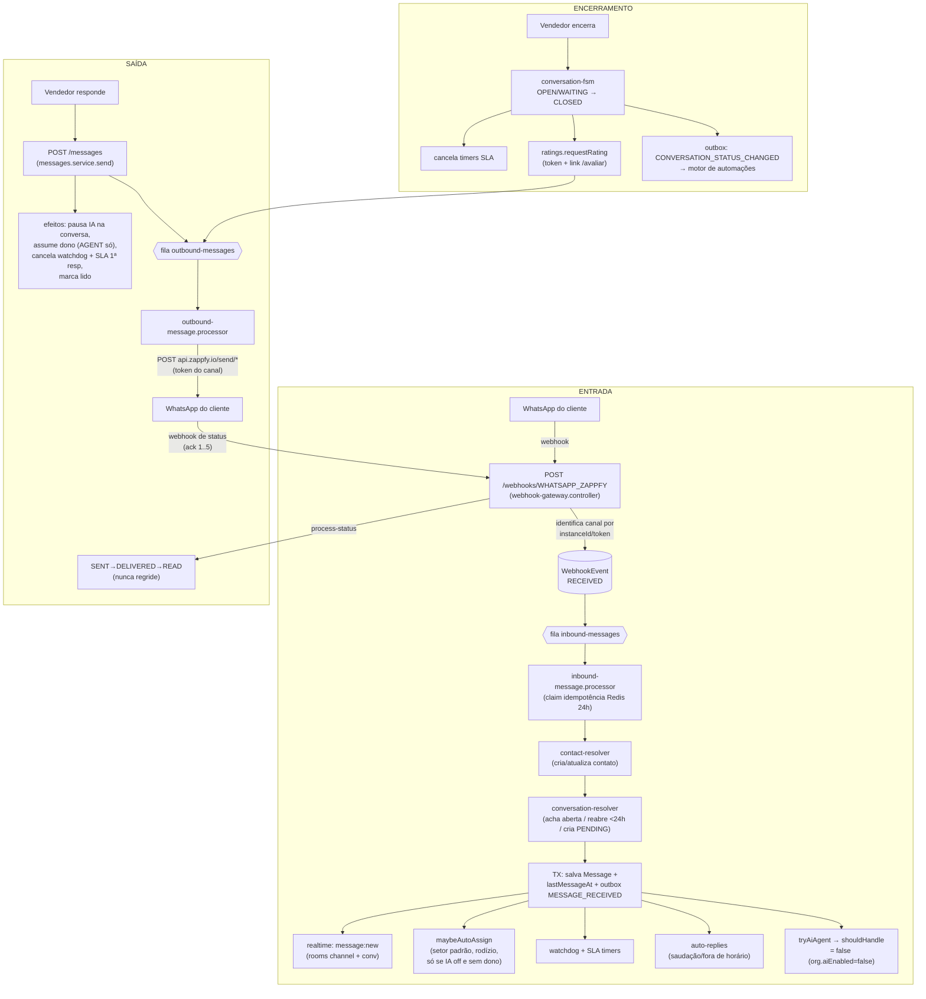

# O Fluxo Real do Conversas — mapa verificado no código

> Levantado em 2026-07-16 por auditoria de código linha a linha (4 agentes de leitura).
> Cada afirmação tem `arquivo:linha`. Isto documenta o que o código **faz**, não o que deveria fazer.
> Estado de produção na data: IA desligada (`org.aiEnabled=false`), auto-assign ligado, equipe = Juliana (única AGENT do setor Geral).

## Visão geral

## 1. Entrada — do webhook à tela

1. **Webhook** `POST /webhooks/:channelType` (público, sempre HTTP 200) — `webhook-gateway.controller.ts:38-47`. Throttle in-memory 600 hits/10s por ip:tipo (`webhook-throttle.guard.ts:18-19`).
2. **Identificação do canal**: `extractLocators` extrai `instanceId`/`token` do payload (`zappfy.inbound-adapter.ts:21-49`); `matchesChannel` casa por instanceId → token (timing-safe) → webhookSecret; sem pista nenhuma = descartado como `no_matching_channel` (`:51-83`). Obs.: "Zappfy" é wrapper comercial do **Uazapi** (`zappfy.http-client.ts:96-133`).
3. **Persistência antes de processar**: todo webhook vira `WebhookEvent` (RECEIVED → PROCESSED/FAILED), payload cru guardado, headers sensíveis redigidos (`webhook-events.service.ts:20-54,93-109`). É o registro que permite replay.
4. **Fila** `inbound-messages`: mensagens = job `process-inbound` (5 tentativas, backoff exp.); acks de status = job `process-status` (3 tentativas) (`webhook-gateway.controller.ts:120-156`).
5. **Idempotência**: `SET idemp:{channel}:{externalMessageId} NX EX 86400` no Redis — só o primeiro worker processa (`idempotency.service.ts:49-62`). Segunda camada: unique `(conversationId, externalId)` no banco com merge não-destrutivo (`inbound-message.processor.ts:515-590`).
6. **Contato**: busca por `(channelId, externalId)`; se novo, cria sob lock Redis. Nunca sobrescreve `name`/`phone` já preenchidos; avatar/profileName atualizam sempre (`contact-resolver.service.ts:27-141`).
7. **Conversa** (`conversation-resolver.service.ts`):
   - Acha aberta (`PENDING/OPEN/BOT/WAITING`) → usa (`:36,118-132`).
   - Senão, última `CLOSED` **< 24h** → **reabre a mesma**: `status=PENDING`, `closedAt=null`, **`assignedToId=null`** (`:56-84`). O dono anterior é perdido — o auto-assign redistribui (hoje: sempre Juliana).
   - Senão cria nova `PENDING` com protocolo `YYYYMMDD-XXXXXX` (`:87-113`).
   - Cliente responde conversa `WAITING` → vira `OPEN` automaticamente (`:149-169`).
8. **Transação única**: salva a mensagem + `lastMessageAt` + enfileira `MESSAGE_RECEIVED` no outbox de automações (`inbound-message.processor.ts:198-246`).
9. **Realtime**: `message:new` para rooms `channel:{id}` e `conv:{id}` (`:248-255`). OWNER/ADMIN entram em todas as rooms de canal; AGENT só nos canais com grant (`realtime.gateway.ts:121-138`).
10. **Auto-assign** (`maybeAutoAssign`, `:395-507`): roda em toda mensagem inbound quando a conversa está **sem dono**, não é grupo, não está em `BOT` e **a IA está OFF pro canal**. Escolhe no setor padrão (Geral) por `distributionRule` (RODÍZIO/MENOS OCUPADO), preferindo agentes ONLINE (cai pra offline se ninguém online). Só seta o dono — **não muda status nem setor**.
11. **Auto-replies** (saudação/almoço/fora de horário): mutuamente exclusivas com a IA pelo mesmo gate; com IA off em prod, **são elas que respondem automaticamente** se habilitadas em `organization.settings.autoReply` (`auto-replies.service.ts:69-151`). Prioridade: fora de horário > almoço > saudação (saudação só na 1ª mensagem). Grupos são pulados.
12. **IA**: `tryAiAgent → shouldHandle` avalia conversa → canal → org (tri-state); com `org.aiEnabled=false` retorna `handle:false` (`agent-router.service.ts:207-286`).

## 2. Saída — da resposta ao WhatsApp

1. `POST /messages` (JWT + org + channel-access) → valida conversa/vínculo, cria `Message` OUTBOUND `QUEUED` (`messages.service.ts:45-149`).
2. **Efeitos colaterais da resposta humana** (`messages.service.ts:159-300`):
   - Pausa a IA na conversa (`aiAutoDisableOnHuman`, default true), salvo force-on/force-off.
   - **Dono**: AGENT que responde assume a conversa; **OWNER/ADMIN respondendo NÃO assume** (modo apoio — regra de 2026-07-16, commit `cdb6e30`).
   - Cancela watchdog e timer SLA de 1ª resposta (o de resolução segue até encerrar).
   - Marca como lida pro remetente; emite `message:new` otimista.
   - Em grupo, prefixa `*Nome do Vendedor*` no texto.
3. **Fila `outbound-messages`** (3 tentativas, backoff): worker escolhe o adapter, envia `POST api.zappfy.io/send/text|media|location` com o token do canal (`outbound-message.processor.ts`, `zappfy.message-mapper.ts:148-255`). Mensagens de IA ganham "digitando..." + delay humanizado; humanas vão direto (`:44-50,195-240`).
4. **Status**: `QUEUED→SENT` no retorno da API; `DELIVERED/READ` chegam por webhook (`process-status`, ack 1..5) e **nunca regridem** (`inbound-message.processor.ts:751-866`). O echo (`fromMe`) da nossa própria mensagem faz merge não-destrutivo e cancela o watchdog.
5. **Falha**: `status=FAILED` + `failedReason` + retry BullMQ (`outbound-message.processor.ts:148-166`).

## 3. Encerramento, CSAT e automações

**Matriz do FSM** (`conversation-fsm.service.ts:13-23`) — transições fora disso = erro 400:

| De → Para | OPEN | WAITING | CLOSED | PENDING | BOT |
|---|---|---|---|---|---|
| PENDING | ✓ | — | — | — | ✓ |
| BOT | — | — | — | ✓ | — |
| OPEN | — | ✓ | ✓ | — | — |
| WAITING | ✓ | — | ✓ | — | — |
| CLOSED | ✓ | — | — | ✓ | — |

Não existe `PENDING→CLOSED` nem `BOT→CLOSED` direto.

- **Ao fechar**: `closedAt`, audit, outbox `CONVERSATION_STATUS_CHANGED` (mesma TX); depois cancela SLA e dispara CSAT (`conversation-fsm.service.ts:40-114`).
- **CSAT só envia se**: a conversa **tem dono**, o canal é WhatsApp ativo, há vínculo de contato e `WEB_URL` configurado (`ratings.service.ts:70-145`). Link `/avaliar/:token`, resposta única (1–5 + comentário), pública.
- **Reabertura** (cliente escreve de novo <24h): mesma conversa volta `PENDING` sem dono → auto-assign. Depois de 24h vira conversa nova.
- **Motor de automações**: outbox transacional (dedup por chave) → poller 1s com `FOR UPDATE SKIP LOCKED` → fila → executor com lock por contato, cascade máx. 4, auto-pausa após 5 falhas (`outbox-poller.service.ts`, `automation-executor.service.ts`). Gate `AUTOMATIONS_ENABLED` (true em prod). Triggers: MESSAGE_RECEIVED, STATUS_CHANGED, ASSIGNED, TAG_ADDED/REMOVED. Ações: add/remove tag, pipeline, assign_user, send_message.
- **Watchdog** (conversa sem resposta): agenda check no inbound; ao disparar, se a IA foi desligada por humano só notifica o dono (nunca religa — "sagrado", `watchdog-timer.processor.ts:101-112`); no limite de tentativas marca `isStuck` e notifica a org toda.
- **Notificações**: só in-app/WebSocket (sino) — sem push nem e-mail (`notification.processor.ts:14-30`).

## 4. Edge cases que valem saber (verificados)

1. **Retry neutralizado pelo claim**: se o job inbound falha *depois* do claim de idempotência, o `catch` re-grava a chave (`markProcessed`) e as tentativas seguintes caem em `duplicate_claim`. Recuperação real = replay do `WebhookEvent FAILED`, não o retry automático (`inbound-message.processor.ts:376-379`; `idempotency.service.ts:67-78`). *Candidato a correção.*
2. **Mensagem sem `externalMessageId` não deduplica** (`idempotency.service.ts:53`).
3. **Reabertura <24h zera o dono** — desenho intencional; hoje inócuo (tudo volta pra Juliana).
4. **Auto-assign não muda status**: lead atribuído fica `PENDING` até a 1ª resposta do vendedor.
5. **Rodízio (`rrCursor`) é em memória**: reinicia no restart e não é compartilhado entre réplicas. Inócuo com 1 vendedor.
6. **ONLINE-first cai pra offline**: se ninguém online, atribui mesmo assim.
7. **Auto-assign ignora grant de canal**: pode atribuir a um AGENT que não recebe realtime daquele canal (conversa "invisível" pro dono). Inócuo hoje (Juliana tem acesso).
8. **Supervisor respondendo conversa sem dono deixa sem dono** até o próximo inbound auto-atribuir (consequência aceita da regra de 2026-07-16).
9. **Saudação não respeita anti-spam** (só o `isFirstInbound`); os outros cenários respeitam `antiSpamHours`.
10. **CSAT nunca sai de conversa sem dono** (hoje impossível — tudo tem dono).
11. **API pública sem rate limit** (`/public/messages`) — chave vazada = disparo em massa. *Pendência conhecida.*
12. **Mídia em disco local** (`uploads/`), não S3 — ok com instância única; quebra em multi-réplica (`uploads.service.ts:22-26`).
13. **Rate limit do adapter Zappfy é declarativo** (1/s, 30/min) — não é aplicado pelo worker.
14. **Grupo inteiro = 1 contato** (id `@g.us`); grupos são pulados por auto-assign e auto-replies.
15. **`/public/messages` cria conversa já CLOSED** de propósito (notificação transacional não polui a fila; resposta do cliente reabre pelo inbound).

## Veredicto de arquitetura

O núcleo (webhook → filas → resolvers → outbox → realtime) é **engenharia séria e coerente**: idempotência em duas camadas, locks distribuídos, outbox transacional, FSM com auditoria, merge de echo. Os problemas reais são periféricos e conhecidos (itens 1, 11, 12 acima) ou vivem no módulo de IA (ver `PLANO-IA-V2.md`). Não há razão técnica para reescrever o core.
